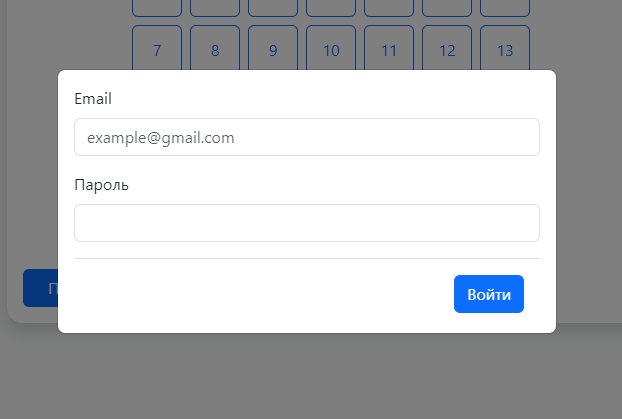
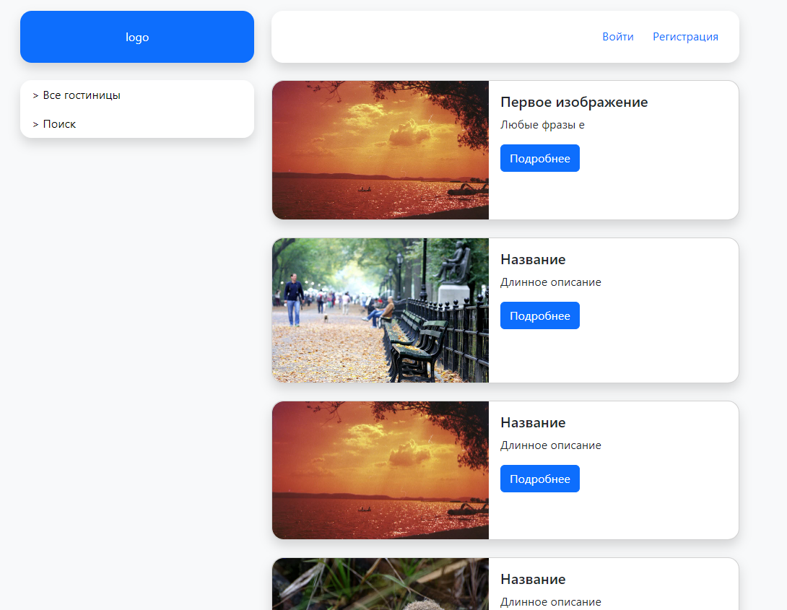

## Инструкции по запуску
1. git clone https://github.com/einsy-dev/Diplom.git // Клонировать репозиторий
2. Заполнить переменные окружения   
#### Docker
    - создать файл env-list и заполнить данные как в env-list--example
#### Без Docker
    - создать файлы .env во frontend и backend директориях, заполнить данные как в .env--example
### Используя Git
#### Выполнить команды для frontend и backend 
    1. npm install   // Установить пакеты
    2. npm run build // Собрать проект
    3. npm run start // Запустить приложение

### Используя Docker
#### Выполнить команду
docker-compose up -d // Собрать и запустить контейнеры 

### Скриншоты
#### Форма регистрации

#### Форма входа

#### Список отелей

#### Страницы отеля
