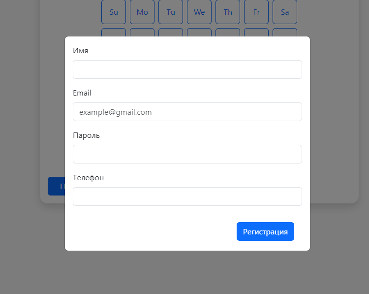
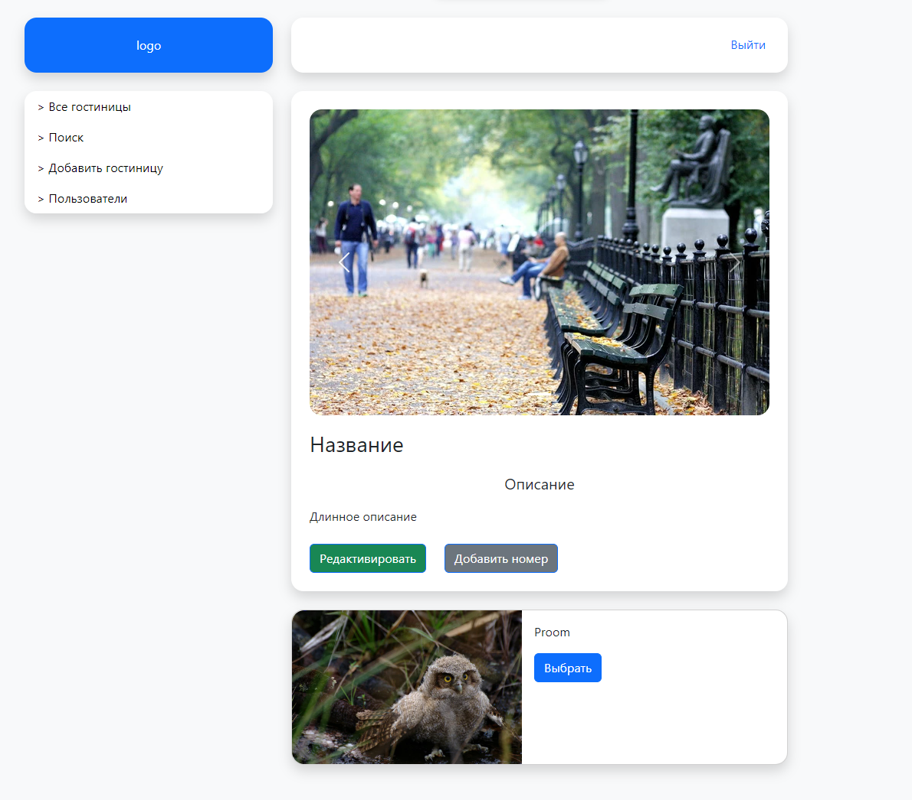

## Инструкции по запуску
1. git clone https://github.com/einsy-dev/Diplom.git // Клонировать репозиторий
2. Заполнить переменные окружения
### Используя Git
#### Выполнить команды для frontend и backend 
    1. npm install   // Установить пакеты
    2. npm run build // Собрать проект
    3. npm run start // Запустить приложение

### Используя Docker
#### Выполнить команду
docker-compose up -d // Собрать и запустить контейнеры 

### Скриншоты

