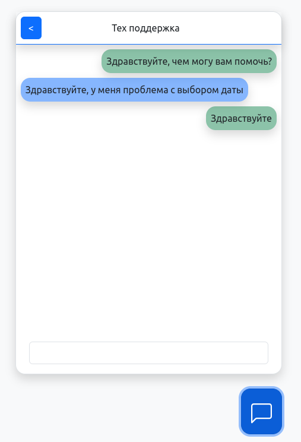
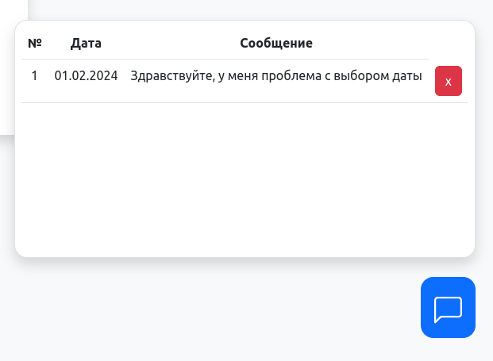
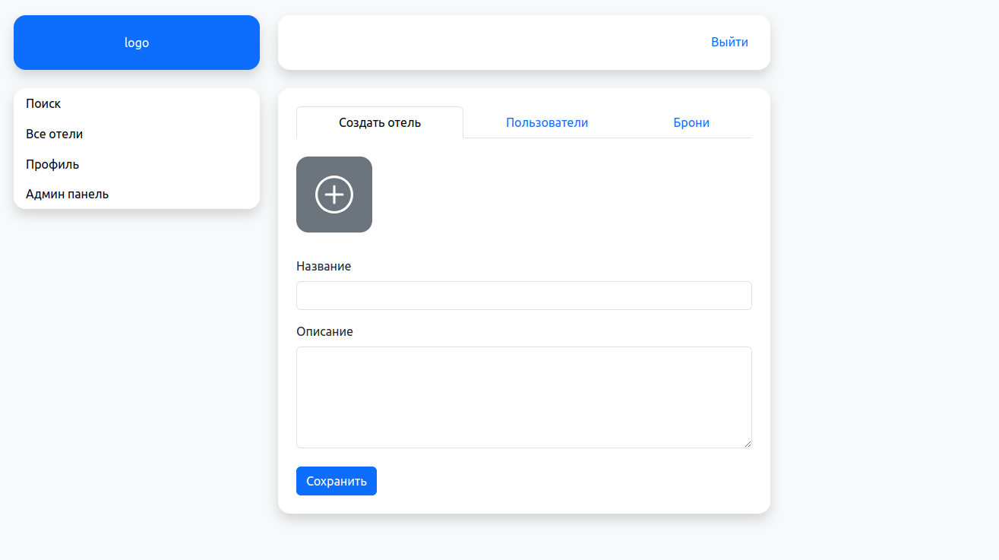

## Инструкции по запуску

1. git clone https://github.com/einsy-dev/Diplom.git // Клонировать репозиторий
2. Заполнить переменные окружения

#### Docker

    - создать файл env-list
    - заполнить данные как в env-list--example

#### Без Docker

    - создать файлы .env во frontend и backend.
    - заполнить данные как в .env--example

### Используя Git

#### Выполнить команды для frontend и backend

    npm install   // Установить пакеты
    npm run build // Собрать проект
    npm run start // Запустить приложение

### Используя Docker

#### Выполнить команду

docker-compose up -d // Собрать и запустить контейнеры

### Скриншоты

#### Форма регистрации

#### Форма входа

#### Список отелей

#### Страницы отеля

#### Окно чата

#### Список чатов

#### Панель админисратора

